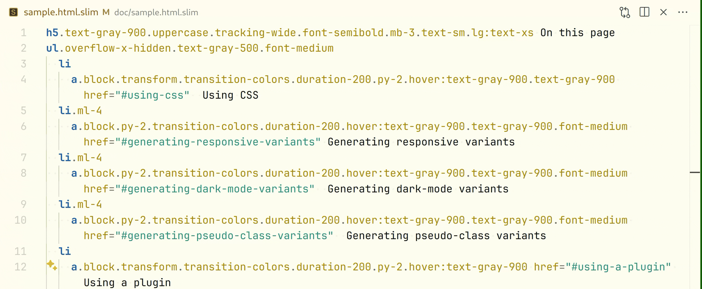
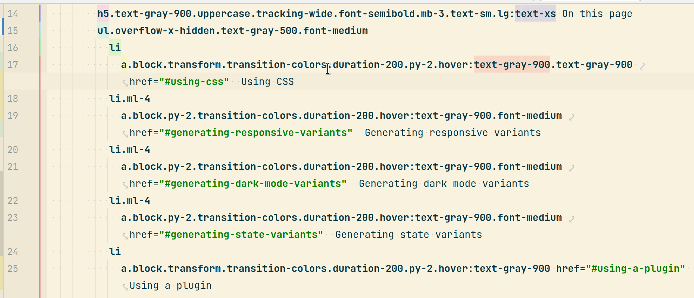

# Tailwind sorter

**A ruby gem to sort the [Tailwind CSS](https://tailwindcss.com) classes in your templates _the custom way_.**

The gem contains a standalone executable script that can work in two ways:

- it can edit the given file in place (especially useful when hooked up to a file changes watcher) or
- it can just generate warning messages suitable for [Overcommit](https://github.com/sds/overcommit),
  [Lefthook](https://github.com/evilmartians/lefthook) or any other similar system (or people, if that’s what you
  prefer).

Out of the box the script supports sorting classes in [Slim templates](http://slim-lang.com/) but can be configured for
anything else. The script also removes duplicate classes.

_This is what it looks like when Tailwind sorter is auto-run upon saving a changed template file in VS Code:_
</img>

_And similarly in RubyMine IDE:_
</img>

Please read the [accompanying post on dev.to](https://dev.to/nejremeslnici/tailwind-css-class-sorter-the-custom-way-35g5) for more details, if interested.

## Why?

We are aware of the other good solutions to sorting Tailwind classes but we’ve hit some limit in each of them:

- [The official Tailwind Prettier plugin](https://github.com/tailwindlabs/prettier-plugin-tailwindcss) is great but does
  not support all template formats, such as [Slim](http://slim-lang.com/).
- [Headwind](https://github.com/heybourn/headwind) is VS Code-only but we needed something in RubyMine and Overcommit,
  too.
- There are ports to the environments we need
  ([Tailwind Formatter](https://plugins.jetbrains.com/plugin/13376-tailwind-formatter/) JetBrains plugin,
  [RustyWind](https://github.com/avencera/rustywind) CLI tool) but none of these support non-standard template formats.
  Also, we like to sort our Tailwind classes a bit differently than Headwind et al. default to.

In our opinion, especially since the [JIT mode](https://tailwindcss.com/docs/just-in-time-mode) has been introduced to
Tailwind, sorters operating over a huge static list of "default" pre-ordered classes are becoming less useful as each
developer will inevitably come to their **own unique set of classes** making it almost impossible to hard-wire a common
solution. This problem is even larger if you’ve added
[custom utility classes](https://tailwindcss.com/docs/adding-new-utilities) to your project.

Above all, it is **surprisingly easy** to create a custom sorting script – the one we use and present here is only
~150 lines. So, take this script and especially its config as a **template for you to revise and adapt**.

## Installation

Since version 0.3, the script has been packed into a gem so that it can be used directly from ruby as well as a standalone script (now a binstub).

### Installing the gem

Install it directly:

```
gem install tailwind-sorter
```

or put it in your gemfile

```
# Gemfile
group :development do
  gem "tailwind-sorter"
end
```

Create a binstub, i.e. a standalone executable script for the sorter:

```sh
$ bundle binstubs tailwind-sorter
```

This will create a `bin/tailwind_sorter` binstub file.

The gem has **no dependencies**, apart from ruby (tested on ruby 3.1+) and its stdlib.

## Configuration

Without customizing, the script will – somehow – work but its full potential will be available only when properly
configured.

There are two important places to configure in the YAML file:

- **regular expressions** that tell the Tailwind sorter where to find CSS classes to sort: out of the box, the script
  matches classes in the Slim format (such as `section#flash-messages.hidden.mt-4`) and classes in the context of the
  `class` attribute in ruby / Rails helpers (`link_to "E-shop", eshop_path, class: "no-underline font-bold red-100")`,

- **CSS classes order and grouping**: the `classes_order` section in the YAML file determines the order in which the
  classes will be sorted. If you want the classes with Tailwind variants (such as `sm:`, `hover:` etc.) to always be
  ordered towards the end of line, put the classes in one big group, otherwise split them into any groups you want and
  they will be ordered last in the particular group.

  You have two options when specifying classes in this config section: pure strings and regular expressions:

  -  You can always just **list the CSS class names** in the config. This style gives you a full control over the ordering and it is the fastest option as well. The downside of it is that you'll find yourself having to update the config more often as new Tailwind classes variants emerge in your project and / or Tailwind itself:

      ```yaml
      classes_order:
        spacing:
          ...
          - py-2
          - py-4
          - py-8
          ...
      ```

  - Or, you can use **regular expressions** to cover all variants of a Tailwind class at once. A regular expression in
    this part of the config is specified as a string delimited by slashes. Note that the
    [`\A` and `\z` boundaries](https://docs.ruby-lang.org/en/master/Regexp.html#class-Regexp-label-Boundary+Anchors) are
    automatically added to the expression so that it always matches the whole class name, not just part of it. Using regular expressions to sort classes shortens your configuration greatly but makes it a bit harder to understand.

    ```yaml
    classes_order:
      spacing:
        ...
        - /py-\d+/
        ...
    ```

  - And, of course, you can also freely mix these two approaches.

Unknown (e.g. your custom) classes will be **ordered first**. If you want to sort them differently, you will have to add them
to the config file to their proper place under `classes_order`. We recommend ordering custom classes first though as in
our opinion such classes usually bear more important meanings than the Tailwind ones and this setup also makes it easier
to spot typos in class names.

The default sort order of the classes in the bundled config file resembles the one of Headwind which, in turn, seems to
be inspired by the order of the sections in the [official Tailwind documentation](https://tailwindcss.com/docs).

More details about the configuration file can be found in
[the wiki](https://github.com/NejRemeslnici/tailwind-sorter/wiki/The-config-file-explanation).

### Adding your unique set of Tailwind classes

The script works best if you only include the classes that you really use in your project. Once you grab all the classes
e.g. from your [JIT-ed](https://tailwindcss.com/docs/just-in-time-mode) production CSS bundle, you can initially reorder them using the following ruby snippet. Suppose you
have the ”default“ Tailwind classes sorted (taken e.g. from
[here](https://github.com/avencera/rustywind/blob/master/rustywind-core/src/defaults.rs), one per line, in
the `default_classes.txt` file and your own (unordered) classes in `our_classes.txt`. Then the sorting could go along these lines:

```ruby
head = File.readlines("default_classes.txt").map(&:strip)
our = File.readlines("our_classes.txt").map(&:strip)
sorted_classes = our.sort_by { |css_class| head.index(css_class) || 10_000 }
File.open("sorted_classes.txt", "w") { |f| f.write(sorted_classes.join("\n")) }
```

Then, you can grab these sorted classes, update the position of your own custom classes (you’ll find them near the end of
the `sorted_classes.txt` file) and move all of them to the appropriate sections of the YAML config file.

## Running the script

You can run the script manually like so:

```sh
bin/tailwind_sorter app/views/my_template.html.slim
```

The script finds all css classes and reorders them in-place in the file.

The script requires the configuration file to be present in `config/tailwind_sorter.yml` by default. You can tweak the configuration file path with the `-c` parameter:

```sh
bin/tailwind_sorter -c path/to/my/config_file.yml app/views/my_template.html.slim
```

## Running automatically via your IDE / editor

Perhaps the best way to run the script is using your editor or IDE. Many editors provide the possibility to watch your
edited files and **run arbitrary command when they are changed / saved**.

We use Tailwind sorter this way, the script is triggered by ”file watchers“ configured in RubyMine and it works great.
Have a look at [the wiki](https://github.com/NejRemeslnici/tailwind-sorter/wiki) for a guide to set up such integration.

## Guarding sort order via Overcommit

We use [Overcommit](https://github.com/sds/overcommit) to guard a common set of rules configured in our project during
each commit. Here, we provide
a [simple pre-commit hook](https://github.com/NejRemeslnici/tailwind-sorter/blob/main/.git-hooks/pre_commit/check_css_classes_order.rb)
and a sample
[configuration in the `.overcommit.yml` file](https://github.com/NejRemeslnici/tailwind-sorter/blob/main/.overcommit.yml#L31)
. The hook calls Tailwind sorter with the `-w` argument, asking it to not change the file but only print the ordering
problems found.

## Running the sorter from ruby code

To run the sorter from ruby code, use the following line:

```ruby
TailwindSorter::Sorter.run("app/views/my_template.html.slim")
```

You can also optionally pass in ome arguments such as `warn_only: true` to only show  warning instead of overwriting the file or `config_file: "path/to/my/config_file.yml"` for custom config path.

## Running tests

```sh
bundle install # to install the rspec gem
bundle exec rspec
.................

Finished in 1.08 seconds (files took 0.03424 seconds to load)
17 examples, 0 failures
```

## Answers for the curious

### But I heard ruby is slow. Is this fast enough?

When we initially reordered CSS classes in all our templates (~900 Slim files) with the script changing nearly 4000
lines, the whole process took less than 30 seconds. This makes the processing speed of approximately 30 files per
second. Judge for yourself if this is fast enough for your needs or not.
